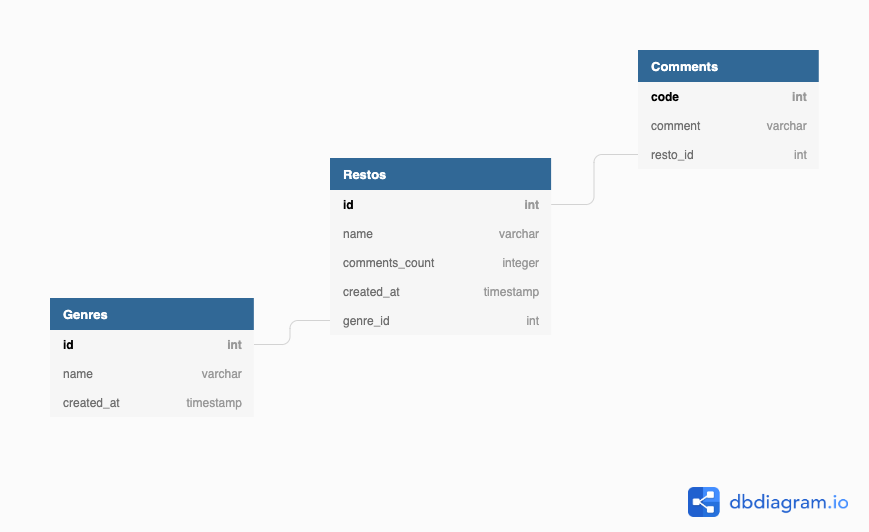

# README

- [Import JS in js.erb](#import-js-methods-in-js.erb)
- [Dynamic and nested forms](#dynamic-and-nested-forms)
  - [Quadruple Dynamic nested form with joint table](#quadruple-dynamic-nested-form)
  - [Dynamic form](#dynamic-form)
  - [Javascript setup](#javascript-setup)
- AJAX Server Rendering (form submission, delete) with a simple one-to-many association with two models (Restaurant/Comments).
- [Queries](#queries)
- [Search](#search-pg_Search) -[Fetch GET with query string](#fetch-get-with-query-string)
- [Editable on the fly](#editable-cell-on-the-fly)
- [Delete Ajax](#delete-ajax)
- [Fetch GET iwth response.text()](#fetch-with-response-text)
- [Drag & Drop](#drag-drop) with `fetch()` 'POST' and `DELETE` and `csrfToken()`

  - [Fetch POST](#fetch-post)
  - [Fetch DELETE](#fetch-delete-and-tabindex-attribute) and [tabindex](#tabindex) attribute

- [Error rendering & form validation](##error-rendering) for browser & backend
- [Kaminari](#kaminari-ajax) setup with Ajax rendering pagination

- [Setup](#setup)
  - [Database model](#database-model)
  - [Counter cache](#counter-cache) quick setup, child model and parent model
  - [Fontawsome](#fontawesome) setup with a _gem_ and `@import`
  - [Bootstrap](#bootstrap) setup with _yarn_ and `@import`

## Import js libraries into _.js.erb_

To add Erb support in your JS templates, run:

```bash
bundle exec rails webpacker:install:erb
```

on a Rails app already setup with Webpacker.

With this setting, we then can create a _.js.erb_ file in the folder _/javascript/packs/_. Then we can use ERB (Ruby parses the file first) and import external libraries with `import { myFunction } from '../components/myJsFile.js`.

In other words, we can import _.js_ libraries into _.js.erb_ files.

> This can save on _data-attributes_ (the `data-something="<%= Post.first.id%>"` in the HTML file with it's searching `document.querySelector('[data-something]')`can be replaced simply by eg `const id = <%= Post.first.id%> in the _.js.erb_ file)

> Note 1: A 'standard' view rendering file _.js.erb_ located in the views does <strong>not</strong> have access to `import`, only those located in the folder _/javascript/packs/_ do (after running `webpacker:install:erb`).

> Note 2: To use a JS library inside a view _.html.erb_ we need to:

- import the library in a _someFile.js.erb_ file in the folder _/javascript/packs/_

- import the _someFile.js.erb_ file in the view with `<t%= javascript_pack_tag 'someFile' %>`

> Note 3: we need to have Turbolinks loaded to access to the DOM, so all the code in the _someFile.js.erb_ file is wrapped as a callback: `document.addEventListener("turbolinks:load", myFunction})`, and declare `const myFunction = ()=> {[...]}` after.

## Dynamic and nested forms

We have a simple three model _one-to-many_ with _Type_, _Restaurant_ and _Client_ and a joint table _Comment_ between _Restaurant_ and _Client_ (with fields resp. _name_, _name_, _name_ and _comment_ ).


```ruby
class Genre < ApplicationRecord
  has_many :restos, -> { order(name: :asc)}
    has_many :comments, through: :restos
    has_many :clients, through: :comments
    validates :name, uniqueness: true, presence: true
    accepts_nested_attributes_for :restos
end

class Resto < ApplicationRecord
  belongs_to :genre, optional: true #, inverse_of: :restos : NO EFFECT
  has_many :comments, dependent: :destroy
  has_many :clients, through: :comments
  validates :name, uniqueness: true, presence: true
  accepts_nested_attributes_for :comments
end

class Comment < ApplicationRecord
  belongs_to :resto, counter_cache: true
  belongs_to :client
  validates :comment, length: {minimum: 2}
  accepts_nested_attributes_for :client
end

class Client < ApplicationRecord
    has_many :comments
    has_many :restos, through: :comments
    has_many :genres, through: :comments, source: :resto

end
```

> The method `accept_nested_attributes_for` works with `has_many`and `belongs_to`

### Quadruple dynamic nested form

We build a form which permits to add four nested inputs: _genre (1>n) restos (1)>n) comments (n<1) client_. We need

- to use `accepts_nested_attributes_for` in the models, both for `has_many` and `belongs_to`
- to build nested records in the controller's method `new` with `@genre.restos.build` for a simple nested association or `@genre.restos.build.comments.build` for a triple nested association, and `build_model` for the `belongs_to` association (where _model_ is _client_ here), so we have `@resto.comments.build.build_client` in the _new_ method.
- use the form builder `fields_for` (both _simple_form_ or _form_with_)

All this will make Rails accept an array of nested attributes of any length, and the formbuilder will render a block for each element in the association.

## Dynamic form

The code written in _/views/genres/new4.html.erb_ calls the partial _/genres/\_nested_dyn_form.html.erb_:

```ruby
<%= simple_form_for genre, url: 'create4', remote: true do |f| %>
    <%= f.error_notification%>
    <%= f.input :name, label:"Genre/Type of restaurant" %>
    <%= f.simple_fields_for :restos do |r| %>
        <%= r.input :name, label:"Restaurant's name" %>
        <%= r.simple_fields_for :comments do |c| %>
        <fieldset data-fields-id="<%= c.index %>">
            <%= c.input :comment, label:"Add a comment" %>
            <%= c.simple_fields_for :client do |cl| %>
                <%= cl.input :name, label: "Join client's name"%>
            <% end %>
        </fieldset>
        <% end %>
    <% end %>
    <%= f.button :submit, "Create!", class:"btn btn-primary", id:"submit-nested" %>
<% end %>
```

Then we inspect the code in the browser what Rails and Simple Form have produced, and copy and adapt it with the correct incrementation (obtained by `c.index`, the index of the formbuilder object, the _comment_)

```ruby
<fieldset data-fields-id="0">
  <div class="form-group string optional genre_restos_comments_comment">
    <label class="string optional" for="genre_restos_attributes_0_comments_attributes_${newId}_comment">Add a comment</label>
    <input class="form-control string optional" type="text" name="genre[restos_attributes][0][comments_attributes][0][comment]" id="genre_restos_attributes_0_comments_attributes_0_comment">
  </div>

  <div class="form-group string optional genre_restos_comments_client_name">
    <label class="string optional" for="genre_restos_attributes_0_comments_attributes_${newId}_client_attributes_name">Join client's name</label>
    <input class="form-control string optional" type="text" name="genre[restos_attributes][0][comments_attributes][0][client_attributes][name]" id="genre_restos_attributes_0_comments_attributes_0_client_attributes_name">
  </div>
</fieldset>
```

This code can be reinjected in the DOM and by changing the ID (it has to be unique), we produce a dynamic form that Rails accepts.
We botain the following hash params for example: (we put `:` instead of `=>`):

```json
#Parameters:
{"genre":{
  "name":"German",
   "restos_attributes":{
      "0":{
        "name":"The Best",
        "comments_attributes":{
          "0":{
            "comment":"Cool",
            "client_attributes":{
              "name":"John"
            }
          },
        "1":{
          "comment":"Bueno",
          "client_attributes":{
            "name":"Mary"
            }
          }
        }
      }
    }
  }, "commit":"Create!"
}
```

corresponding to the strong params method:

```ruby
def resto_params
      params.require(:resto).permit(:name,:genre_id,
        comments_attributes: [:id, :comment,
          client_attributes: [:client_id
          ]
        ]
      )
    end
```

We just automatize this with Javascript. In particular, we inject the index `<%= c.index %>` of the formbuilder object as a dataset for Javascript to read it. Then Javascript will just determine the greatest index and assign an incremented index - unique - to the new injected nested form.

We use JS in a _js.erb_ file ot inject the HTML code. We want a button to add new input fields and assign a unique id, and a form _submit_ button.

```js
// # restos/new.js.erb
document
  .getElementById("form_Resto")
  .insertAdjacentHTML(
    "afterbegin",
    `<%= j render 'restos/form', resto: @resto %>`
  );

function dynComment() {
  const createCommentButton = document.getElementById("addComment");
  createCommentButton.addEventListener("click", (e) => {
    e.preventDefault();
    const arrayComments = [...document.querySelectorAll("fieldset")];
    const lastId = arrayComments[arrayComments.length - 1];
    const newId = parseInt(lastId.dataset.fieldsId, 10) + 1;

    document.querySelector("#new_resto").insertAdjacentHTML(
      "beforeend",
      `
      <fieldset data-fields-id="0">
  <div class="form-group string optional genre_restos_comments_comment">
    <label class="string optional" for="genre_restos_attributes_0_comments_attributes_${newId}_comment">Add a comment</label>
    <input class="form-control string optional" type="text" name="genre[restos_attributes][0][comments_attributes][${newId}][comment]" id="genre_restos_attributes_0_comments_attributes_${newId}_comment">
  </div>

  <div class="form-group string optional genre_restos_comments_client_name">
    <label class="string optional" for="genre_restos_attributes_0_comments_attributes_${newId}_client_attributes_name">Join client's name</label>
    <input class="form-control string optional" type="text" name="genre[restos_attributes][0][comments_attributes][${newId}][client_attributes][name]" id="genre_restos_attributes_0_comments_attributes_${newId}_client_attributes_name">
  </div>
</fieldset>
       `
    );
  });
}

document.getElementById("addComment").onclick = dynComment();
```

### Javascript setup

```js
# views/layout/application
 <%= javascript_pack_tag 'application', 'data-turbolinks-track': 'reload', defer: true %>

# javacsript/packs/applications.js
import { createComment } from "../components/createComment.js";
// for Turbolinks to work with Javascript
document.addEventListener("turbolinks:load", () => {
  const createCommentButton = document.getElementById("newComment");
    if (createCommentButton) {
      createComment();
    }
  [... all other methods called here ....]
});
```

When the button _ create comment_ is clicked, we want to inject by Javascript a new input block used for _comment_ We need a unique id for the input field. Since we have access to the formbuilder index, we save this id in a dataset, namely add it to the fieldset that englobes our label/input block. By JS, we can attribute a unique id to the new input by reading the last block.

## Queries

Some ActiveRecord queries

- WHERE needs **table name** and JOINS needs the **association name**.

Given a `client = CLIENT.find_by(name: "myfavorite")`, we can find the restaurants on which he commented with `client.restos`, and the genres he commented on with `client.genres`.

Conversely:
given a `resto = RESTO.find_by('restos.name ILIKE ?', "%Sweet%")`, we can
find the clients that gave a comment with the equivalent queries:

```ruby
  Resto.joins(comments: :resto).where('clients.name ILIKE ?', '%coralie%')
```

Given a `genre = Genre.find_by(name: "thai")`, we can find the clients gave a comment with:

```ruby
Genre.joins(restos: {comments: :client}).where(clients: {name: "Coralie Effertz"}).uniq

Genre.joins(restos: {comments: :client}).merge(Client.where("clients.name= ?",  "Coralie Effertz")).uniq

Genre.joins(restos: {comments: :client}).merge(Client.where("clients.name ILIKE ?",  "%Coralie%")).uniq

Genre.joins(restos: {comments: :client}).where("clients.name ILIKE ?","%Coralie%").uniq
```

## Search pg_Search

We implemented only a full-text `pg_search` in the page _comments_ on two columns of associated tables (_restos_ and _comments_).

```ruby
# /views/restos/index.html.erb
<%= simple_form_for :search, method: 'GET' do |f| %> (note: a form is 'POST' by default)
<div class="input-field">
  <%= f.input_field :g, required: false, placeholder: "blank or any 'type'"  %>
  <%= f.input_field :r, required: false, placeholder: "blank or any 'type'"  %>
  <%= f.input_field :pg, required: false, placeholder: "blank or any 'type'"  %>
  <%= button_tag(type: 'submit', class: "btn btn-outline-success btn-lg", style:"padding: .8rem 1rem") do %>
    <i class="fas fa-search" id="i-search">&lt/i>
  <% end %>
</div>
<% end %>
```

```ruby
# model Comment
class Comment < ActiveRecordion
  # Usage of question mark "?" to SANITIZE against SQL injection
  scope :find_by_genre, ->(name) {joins(resto: :genre).where("genres.name ILIKE ?", "%#{name}%")}
  scope :find_by_resto, ->(name) {joins(:resto).where("restos.name ILIKE ?", "%#{name}%")}

  include PgSearch::Model
      multisearchable against: :comment

  pg_search_scope :search_by_word, against: [:comment],
      associated_against: {
          resto: :name
          # !! use the association name
      },
      using: {
          tsearch: { prefix: true }
      }

  # helper to avoid repeating comments = Comment.find_by_xxx(qurey[:x])
  def self.sendmethod(m,q)
    comments = self.send(m, q)
    return  comments.any? ? comments :  self.all
  end


  def self.search_for_comments(query)
    # page load
    return Comment.all if !query.present? || (query.present? && query[:r]=="" && query[:g]=="" && query[:pg]=="")

    if !(query[:r]== "")
      return self.sendmethod(:find_by_resto, query[:r])

    elsif query[:g] != ""
      return self.sendmethod(:find_by_genre, query[:g])

    elsif query[:pg] != ""
      return self.sendmethod(:search_by_word, query[:pg])
    end
  end
end
```

and the mode _Resto_ needs also:

```ruby
#model Resto
class Resto < ActiveRecord
[•••]
include PgSearch::Model
  multisearchable against: :name
[•••]
end
```

Then, the controller's index method includes the search results (and avoids N+1 with 'includes' and uses Kaminari's pagination)</p>

```ruby
#comments_controller.rb
def index
  @comments = Comment.includes(:resto).order('restos.name').search_for_comments(params[:search]).page(params[:page])
end
```

### Fetch GET with query string

For a `GET` request, there is no need for `CORS`. We used:

- `new FormData` on `e.target` as we listened to the _submit_ of the form, and then
- `new URLSearchParams().toString()`

to convert the input of a form into a query string added to the end point `/restos?`.

This produces for example `/restos?search%5Bg%5D=burgers&search%5Br%5D=&button=` if `params[:search][:g]="burgers",params[:search][:r]="",params[:search][:r]=""`)

```js
async function getSearchRestos() {
  const searchForm = document.querySelector('[action="/restos"]');
  searchForm.addEventListener("submit", async (e) => {
    e.preventDefault();

    const data = new FormData(e.target);
    const uri = new URLSearchParams(data).toString();
    console.log(uri);
    try {
      const request = await fetch("/restos?" + uri, {
        method: "GET",
        headers: {
          "Content-Type": "application/json",
          Accept: "application/json",
        },
      });
      const response = await request.json();
      console.log(response);
    } catch (error) {
      console.warn(error);
    }
  });
}
```

##

## Editable cell on the fly

[Back to Contents](#readme)

We can edit directly the name of the restaurant and save. Firstly we need to use the attribute `contenteditable = true`. Then, there is a hidden form under the button _submit_. When Rails renders the HTML view, the (hidden) form will be initially populated with the object values, as a standard _edit mode_ form. We use the form helper `form_with` and provide the object `model: @esto`. Then, the save method will automatically be _patch/put_.

We attached a listener to every editable cells (the names of the restaurants), and every change is captured with the event `input`. We build a Javascript function such that every event triggers a copy of the innerText into the input of the hidden form. When we validate, the form is submitted to the database with PATCH / UPDATE, so this happens in the background.

The JS helper that copies directly from the cell to the form input every change in the cell.

```js
const copyActive = (tag) => {
  document.querySelectorAll("td").forEach((td) => {
    td.addEventListener("input", (e) => {
      const id = e.target.dataset.editable;
      document.querySelector(tag + id).value = e.target.innerText;
    });
  });
};
```

## Add on the fly

View: comments. We can create a comment and select the parent model (restaurant) from a _select_ list. We can also a new restaurant which will populate the _select_ list and appear on the top. All Ajax.

## Delete Ajax

[Back to Contents](#readme)

The Delete method is Ajax rendered. The link calls the _restos#destroy_ method. It reads the query string with the _params hash_, then querries the database with the found _ID_ and delete it from the database.

We declared `dependent: :destroy` in the model; this is similar to `@resto.comments.destroy_all` so all associated objects will be deleted together with the parent.

Then the link has the attribute `remote: true`, so the method will respond to with _destroy.js.erb_ to render dynamically
the view in the browser. To update the view, namely delete a row, we need to select it with Javascript so we need to pass the ID information
from Rails to Javascript to be able to remove the correct row. We use datasets for this. When Rails renders the HTML, Rails will write the IDs given by the database in a dataset for every object, with the HTML.ERB code:

```
<tr data-resto-id = '&lt%=resto.id%>'>
```

(we used a `<table>` to present the data above).

Since we use the file format _js.erb_, this file will be firstly parsed by Rails and then Javascript. The code of this file is:

```js
document.querySelector('[data-resto-id = &lt%= @resto.id %>"]').remove();
```

In the first parse, Rails _restos#destroy_ knows the instance `@resto` and will put the 'real' value for `&lt%= @resto.id %>`, say "13" for example. Then Javascript reads the string `data-resto-id = "13"`, finds the correct `&lttr>` in the DOM, and acts with `.remove()`. Et voilà.

## fetch with response text

The list of clients is rendered by the controler _clients#index_ in the view _/views/clients/index.html.erb_. On page load, we ask the controller to return an empty array, and there is a button to display all of them. To do so, we used a dummy query string pointing to `http://localhost:3000/clients` with params `?=c=" "` so that the controller can respond with `Client.all.includes(comments: {resto: :genre})` when the button is trigger. We ask the controller to serve the collection of clients in format _text_ with a partial with no layout, with `render partial: 'clients/client', collection: @clients, layout: false` so Rails sends a prefilled text response to the browser. Then we have a Javascript method `fetch()` that reads the response and parses it into _text_ format, and inserts inot the DOM.

> we can use the method `.innerHTML` here (otherwise, only `.insertAdjacentHTML`)

```js
const fetchClients = (tag) => {
  document.querySelector(tag).addEventListener("click", async (e) => {
    e.preventDefault();
    console.log("ici");
    try {
      const query = await fetch('/clients?c=""', {
        method: "GET",
        headers: {
          "Content-Type": "text/html",
          Accept: "text/html",
        },
        credentials: "same-origin", // default value
      });
      if (query.ok) {
        const content = await query.text();
        return (document.querySelector("#client_articles").innerHTML = content);
      }
    } catch (error) {
      throw error;
    }
  });
};
```

[Back to Contents](#readme)

## Drag Drop

[Back to Contents](#readme)

- we need to add the _draggable_ attribute to the node we want to make draggable
- we add a listener on the _dragstart_ event to capture the start of the drag and capture data in the _DataTansfer_ object. The `dataTransfer.setData()` method sets the data type and the value of the dragged data. We can only pass a string in it so we stringify the object we pass.

```js
document.addEventListener("dragstart", (e) => {
    // we define the data that wil lbe transfered with the dragged node
    const draggedObj = {
      idSpan: e.target.id,
      resto_id: e.target.dataset.restoId,
    };
    e.dataTransfer.setData("text", JSON.stringify(draggedObj));
```

By default, data/elements cannot be dropped in other elements. To allow a drop on an element, it needs:

- to listen to the _dragover_ event to prevent the default handling of the element,

```js
document.addEventListener("dragover", (e) => {
  e.preventDefault();
});
```

- listen to the _drop_ event: here we accept to drop on an element that has the class "drop-zone". We can then use the data contained in the _DataTransfer_ object with the `dataTransfer.setData()` method.

Then, for a _drop_ event, we construct an object `data={resto:{genre_id:"value", id:"value}}` and transmit it to the Rails backend with a `fetch()` with _POST_. This will update the dragged element with it's property (_resto_id_ with correct _genre_id_) and persist to the database. This is done by calling a dedicated method of a Rails controller.

```js
document.addEventListener("drop", async (e) => {
    e.preventDefault();
    // permits drop only in elt with class 'drop-zone'
    if (e.target.classList.contains("drop-zone")) {
      const transferedData = JSON.parse(e.dataTransfer.getData("text"));

      const data = {
        resto: {
          genre_id: e.target.parentElement.dataset.genreId,
          id: transferedData.resto_id,
        },
      };
      // the method `postGenreToResto` is a `fetch`with a Rails ended-point defined after
      await postGenreToResto(data).then((data) => {
        if (data) {
          // status: ok
          e.target.appendChild(document.getElementById(transferedData.idSpan));
        }
      });
    }
  });
}

```

### Fetch POST

We need to get the _csrf token_ from the session given by Rails since it is an internal request and Rails serve as an API.

We define a custom route that likes to a method that updates the params sent by the `fetch()` Javascript method.

```ruby
# routes
patch 'updateGenre', to:'restos#updateGenre'
```

The method _updateGenre_ simply reads the _params_ hash (formatted as `{resto:{id: value, name: value}}`) and saves it to the database.

```js
import { csrfToken } from "@rails/ujs";

const postGenreToResto = async (obj = {}) => {
  try {
    const response = await fetch("/updateGenre", {
      method: "PATCH",
      headers: {
        Accept: "application/json",
        "X-CSRF-Token": csrfToken(), // for CORS since it is an internal request
        //document.getElementsByName("csrf-token")[0].getAttribute("content"),
        "Content-Type": "application/json",
      },
      credentials: "same-origin", //if authnetification with cookie
      body: JSON.stringify(obj),
    });
    return await response.json();
  } catch (err) {
    console.log(err);
  }
};
```

### Fetch DELETE and tabindex attribute

To delete a 'type', we first need to read/find it, and then transmit the data to a Rails end-point by a `fetch()`DELETE method. Then the Rails bakcned will try to delete it (depending upon the validations), and then upon success, the Javascript will remove (or not) the element from the DOM.

> We add a _tabindex_ attribute `tabindex="0"` to make the 'type" element clickable.

> We can then listen to a _clic_ event with the `document.activeElement`

We use `activeElement` because the list of clickable items can change, so we couldn't use a _querySelector_ which acts on a fixed list. With an `document.activeElement` that corresponds to a certain 'type' (we added a class _genre_tag_ to find the 'type' items only), we have access to the properties of the item.

```js
function listenToGenres() {
  document.querySelector("#tb-genres").addEventListener("click", () => {
    const item = document.activeElement;
    if (item.classList.contains("genre_tag")) {
      document.querySelector("#hiddenId").value =
        item.parentElement.parentElement.dataset.genreId;
      document.querySelector("#genre_to_delete").value = item.textContent;
    }
  });
}
```

Then we save the _id_ in a hidden input. On submit, the `fetch()` DELETE query is triggered.
Tthe Rails end-point is defined by a custom route:

```ruby
delete 'deleteFetch/:id', to: 'genres#deleteFetch'
```

The _deleteFetch_ method renders: `render json: {status: :ok}` so the `fetch`method will process it and react upon success.

```js
function destroyType() {
  document
    .querySelector("#genreDeleteForm")
    .addEventListener("submit", async (e) => {
      e.preventDefault();
      const id = document.querySelector("#hiddenId").value;
      try {
        const query = await fetch("/deleteFetch/" + id, {
          method: "DELETE",
          headers: {
            Accept: "application/json",
            "X-CSRF-Token": csrfToken(),
            "Content-Type": "application/json",
          },
          credentials: "same-origin",
        });
        const response = await query.json();
        if (response.status === "ok") {
          document.querySelector(`[data-genre-id="${id}"]`).remove();
          document.querySelector("#genreDeleteForm").reset();
        }
      } catch {
        (err) => console.log("impossible", err);
      }
    });
```

## Error rendering

[Back to Contents](#readme)

Browser validation `required: true` with the setup `config.browser_validations = true` used with _simple_form_for_ in _#config/initializers/simple_form.rb_

With _Simple_Form_, we just need:

```ruby
<%= simple_form_for @comment do |f|>
 <%= f.error_notification %>
 ....
```

but with _form_with_, we may need to add:

```ruby
<%= form_with model: @comment do |f| %>
<%= render 'shared/errors', myvar: f.object %>
...
```

where:

```ruby
#shared/_erros.html.erb
<% if myvar.errors.any? %>
    <div>
      <h2><%= pluralize(myvar.errors.count, "error") %> prohibited this item from being saved:</h2>

      <ul>
        <% myvar.errors.full_messages.each do |message| %>
          <li><%= message %></li>
        <% end %>
      </ul>
    </div>
  <% end %>
```

To render errors when the form is AJAX submitted, we can do:

```js
if (<%= @myobject.errors.any? %>) {
    const myDivAboveTheForm = document.querySelector("#myDivAboveTheForm")
    myDivAboveTheForm.innerHTML = ""
    myDivAboveTheForm.insertAdjacentHTML('beforeend',`<%= j render 'restos/form' %>`)

} else {
    ....do something
}
```

## Kaminari AJAX

[Back to Contents](#readme)

Installation: put `gem kaminari` in _gemfile_, `bundle`, and run `rails g kaminari:config`: this generates the default configuration file into _config/initializers_ directory. We set here:

```ruby
#/config/initializers/kaminari_config.rb
Kaminari.configure do |config|
  config.default_per_page = 5
end
```

We tweaked the pagination helper with Bootstrap4 template them, running `rails g kaminari:view bootstrap4`.

```ruby
class CommentsController < ApplicationController

  # GET /comments
  def index
    @comments = Comment.includes([:resto]).page(params[:page])
    respond_to do |format|
      format.js
      format.html
    end
  end
```

In the _index.html.erb_ views of _Comments_, we add the pagination link and extract a partial of the data that will be paginated (namely the `<tbody>` part)

```
# views/comments/index.html.erb
<div id="paginator">
    <%= paginate(@comments, remote: true)  %>
</div>

<table>
  <thead>
  ...
  <tbody id="tb-comments">
    <%= render 'comments/table_comments', comments: @comments %>
  </tbody>
  </thead>
</table>
```

We extract in a partial the body of the table that will be paginated
where the partial that iterates oever `@comments = Comment.all`:

```
# /views/comments/_table_comments.html.erb
<% comments.each do |comment| %>
    <tr data-comment-id= "<%= comment.id %>" >
    <td contenteditable="true" data-editable="<%= comment.id %>"><%= comment.comment %> </td>
    <td><%= comment.resto.name %></td>
    ...
```

And we create a file _index.js.erb_ that contains:

```js
document.querySelector("#tb-comments").innerHTML = "";
document.querySelector(
  "#tb-comments"
).innerHTML = `<%= j render 'comments/table_comments', comments: @comments %>`;
document.querySelector(
  "#paginator"
).innerHTML = `<%= j paginate(@comments, remote: true)%>`;
```

Et voilà.

## Setup

[Back to Contents](#readme)

### Database model



```
> rails g model genre name
> rails g model resto name comments_count:integer genre:references
> rails g model comment comment resto:references
> rails db:create db:migrate
```

```sql
#postgresql
CREATE TABLE "Genres" (
  "id" SERIAL PRIMARY KEY,
  "name" varchar,
  "created_at" timestamp
);
CREATE TABLE "Restos" (
  "id" int PRIMARY KEY,
  "name" varchar,
  "comments_count" integer,
  "genre_id" int,
  "created_at" timestamp
);
CREATE TABLE "Comments" (
  "code" int PRIMARY KEY,
  "comment" varchar,
  "resto_id" int
);
ALTER TABLE "Restos" ADD FOREIGN KEY ("genre_id") REFERENCES "Genres" ("id");
ALTER TABLE "Comments" ADD FOREIGN KEY ("resto_id") REFERENCES "Restos" ("id");
```

### Counter cache

In the view _#views/restos/index.html.erb_, we have an iteration with a counting output `<td> <%= resto.comments.size %></td>`. If we use `count`, we fire an SQL query. We can use _counter_cache_ to persist the count in the database and Rails will update the counter for us whenever a comment is added or removed.

> Add `counter_cache` in the _child_ model (`Comment`here).

```ruby
class Comment < ApplicationRecord
  belongs_to :resto, counter_cache: true
  # requires a field comments_count to the Resto model
  validates :comment, length: {minimum: 2}
end
```

> Add a field `comments_count` to the _parent_ model (`Resto`model here).

```
rails g migration AddCommentsCountToRestos comments_count:integer
rails db:migrate
```

> Note: to count the number of comments by restaurant with SQL/Ruby, we do:

```sql
JOINS( 'restos' )
.SELECT ("restos.*, 'COUNT("comments.id") AS comments_count')
.GROUP('restos.id')
```

<https://blog.appsignal.com/2018/06/19/activerecords-counter-cache.html>

### Fontawesome

```ruby
# gemfile
gem 'font-awesome-sass', '~> 5.12'
#application.scss (respect the order)
@import "font-awesome-sprockets";
@import "font-awesome";
```

### Bootstrap

```bash
yarn add bootstrap
```

```ruby
#application.scss
@import "bootstrap/scss/bootstrap";
```

and

```bash
rails generate simple_form:install --bootstrap
```

### Faker

```ruby
#gemfile
group :development do
  gem 'faker', :git => 'https://github.com/faker-ruby/faker.git', :branch => 'master'
end
```

[Back to Contents](#readme)

### Misc

- generate Rails new app with:

```bash
rails new nompapp --webpack --database:postgresql
```

- change application.css to a SCSS file so that I can use @import directive

- to present a `select` ordered alphabetically:

```ruby
Resto.all.order(name: :asc)
```
